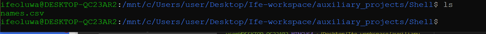
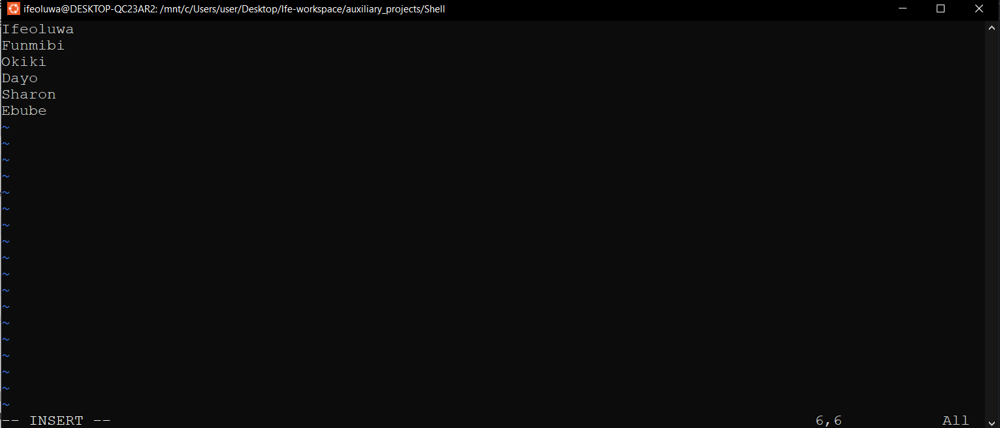
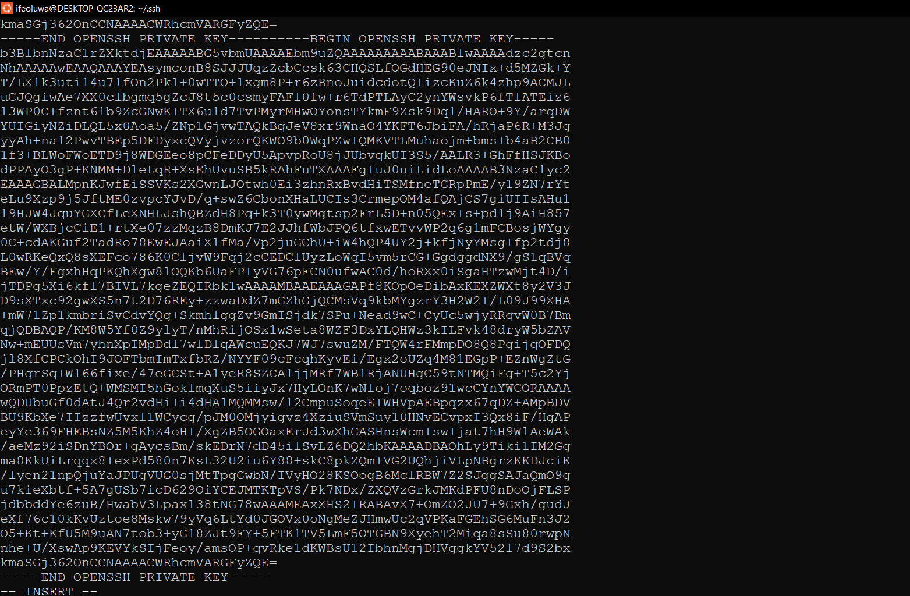
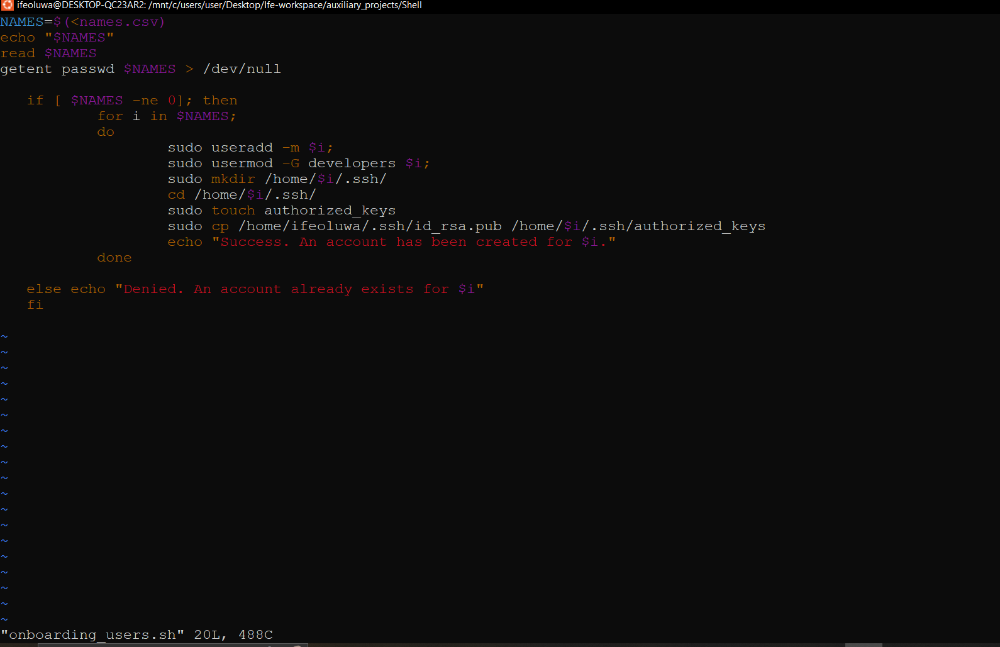
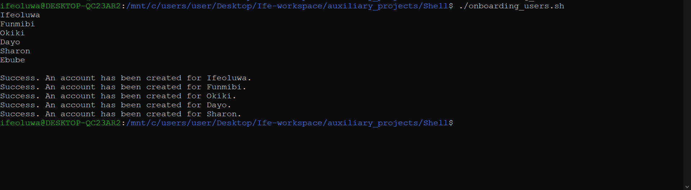

### SHELL SCRIPTING
> Create a project folder called Shell

    mkdir Shell
> Move into the Shell folder

    cd Shell
> Create a csv file names names.csv

    touch names.csv

> Open csv file with vim and insert the following

    Ifeoluwa
    Funmibi
    Okiki
    Dayo
    Sharon
    Ebube

> Create group called developers
> Confirm the file created is a .csv file

> The script must check for the existence of the user on the system and give a n0n-zero exit status if user is not found

    getent passwd $NAMES /dev/null

> The users created must also have a default home folder

    sudo useradd -m $i;
    where i is the name of the users

> Create an authorized_keys file for each users SSH configuration
    touch authorized_keys

> The public key of the current user must be present
> Change directory into the .ssh folder
> Create a file for the public key

    touch id_rsa.pub
> Open the file using vim, paste public key

> Create a file for the private key and vim into it to paste the private key

    touch id_rsa
    vim id_rsa

> Each user must have .ssh folder within its home folder

    sudo cp /home/ifeoluwa/.ssh/id_rsa.pub /home/$i/.ssh/authorized_keys

> The complete script of the project

> Run the script

    ./onboarding_users

